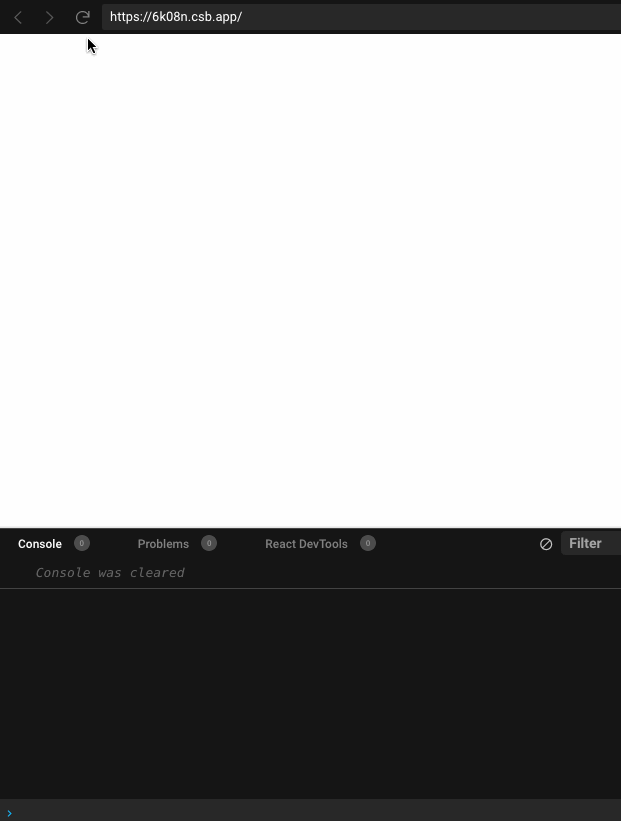

When working with asynchronous calls, for example API calls, you might have encountered this error :

`Can't perform a React state update on an unmounted component. This is  a no-op, but it indicates a memory leak in your application. To fix,  cancel all subscriptions and asynchronous tasks in a useEffect cleanup  function.`


## A GIF is worth a thousand words ...



This is a small page that simulates some asynchronous logic on load, and then updates the view accordingly. Here, I unmount the component before the async work has been finished, and trigger the Error. (I took this example from [this](https://stackoverflow.com/questions/56442582/react-hooks-cant-perform-a-react-state-update-on-an-unmounted-component/63176693#63176693) StackOverFlow post)

This is caused by this code :

`````javascript
function Example() {
  const [text, setText] = useState("waiting...");

  useEffect(() => {
    simulateSlowNetworkRequest().then(() => {
      setText("done!"); // ⚠️ what if the component is no longer mounted ?
      // => Warning: Can't perform a React state update on an unmounted component.
    });
  }, []);

  return <h2>{text}</h2>;
}
`````

When running into that issue, I found multiple solutions, the most used one seems to be this one :

`````javascript
function OtherExample() {
	const [text, setText] = useState("waiting...");

  useEffect(() => {
    let isMounted = true; // 👈
    simulateSlowNetworkRequest().then(() => {
      if (!isMounted) { // 👈
        setText("done!"); // no more error
      }
    });
    return () => {
      isMounted = false; // 👈
    };
  }, []);

  return <h2>{text}</h2>;
}
`````

**But** it requires you to add quite a lot of stuff into your component, having to deal with that `isMounted` variable all over the place ...

There are other interesting solutions, like making your [Promises cancellable](https://dev.to/viclafouch/cancel-properly-http-requests-in-react-hooks-and-avoid-memory-leaks-pd7).

## You told me there would be an elegant solution !

I wasn't lying! The solution I came up with is a very simple [hook](https://www.npmjs.com/package/use-state-if-mounted). It works just like React's useState, but it basically checks if the component is mounted before updating the state !

Here is an example of the refactored code :

```javascript
function OtherExample() {
  const [text, setText] = useStateIfMounted("waiting..."); // 👈

  React.useEffect(() => {
    simulateSlowNetworkRequest().then(() => {
      setText("done!"); // no more error
    });
  }, [setText]);

  return <h2>{text}</h2>;
}
```

Here is the [CodeSandBox](https://codesandbox.io/s/use-local-variable-to-avoid-setstate-on-unmouted-component-6k08n?file=/src/index.js:459-695) if you wanna play around !

## TLDR
Use [useStateIfMounted](https://www.npmjs.com/package/use-state-if-mounted) hook, that will only update the state if your component is mounted ! 🚀


I hope this might be helpful, feel free to reach me out in any case ! 🤗