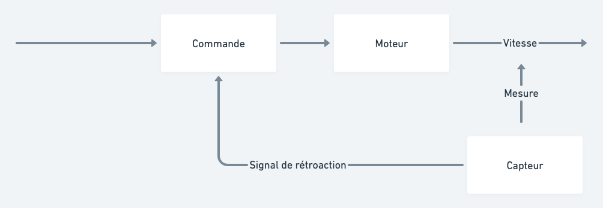
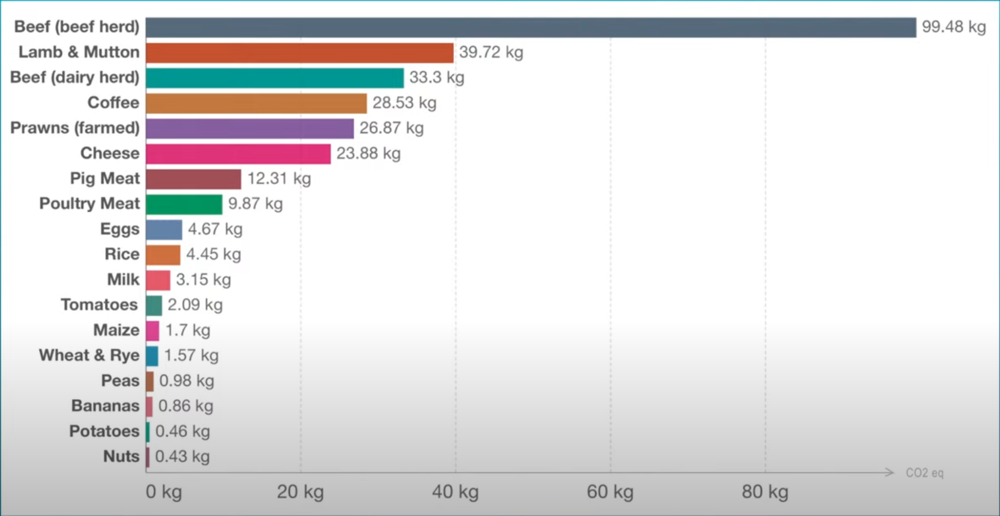
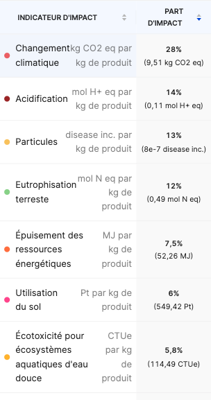

Le climat se dérègle, ce n'est plus un débat. On a aussi des problèmes de disponibilité des ressources fossiles, de dérèglement de la biodiversité, de disponibilité de l'eau ... Ça commence à faire beaucoup d'infos à digérer.

Une fois qu'on a choisi d'agir pour les causes environnementales, par où commencer ? Comment peut-on prioriser nos actions ?

Sans prétendre répondre complètement à ces questions, je partage ici un morceau de cheminement.

Je vais principalement prendre des exemples liés au monde de l'agro-alimentaire, parce que c'est le domaine que je connais le mieux.

## On améliore ce qu'on mesure

Pour vérifier qu'on fait bien quelque chose, en général, on prend des mesures, et ensuite on s'adapte. C'est comme ça que fonctionne un régulateur de vitesse, il mesure la vitesse à un instant T, puis il demande au moteur d'adapter sa cadence en fonction de ce qu'il mesure.

Grosso modo, ça ressemble à ça.

En principe, on peut essayer de contrôler n'importe quelle grandeur avec ce genre de système. C'est comme ça qu'on peut faire un métro automatique, ou même qu'on commande les pales d'un hélicoptère.

Après cette petite aparté technologique, revenons au sujet qui nous intéresse. Est-ce qu'on peut mesurer un impact environnemental ?

Évidemment, tout le monde connait l'empreinte carbone. Les plus habitués de cette notion connaissent même les subtilités du "CO2 équivalent", avec la prise en compte des différents gaz à effet de serre.

On peut même comprendre ce que ça représente avec des simulateurs proposés par l'ADEME comme [Mon convertisseur CO2](https://datagir.ademe.fr/apps/mon-convertisseur-co2/).

Mais si on ne mesure que l'empreinte carbone, on oublie tout le reste ! Est-ce qu'il vaut mieux limiter son empreinte carbone mais aggraver son empreinte eau ?

> Empreinte Carbone de produits alimentaires 

> Empreinte eau de produits alimentaires 

Par exemple, lorsqu'on consomme une noix, on a un bilan en CO2 extrêmement faible (c'est une culture qui stocke du carbone), mais on a une empreinte eau très forte.

On a besoin d'une grandeur qui nous permettrait d'éviter les **transferts d'impact**.

## Comment éviter les transferts d'impact ?

La commission Européenne a demandé à des scientifiques de se mettre d'accord sur la question, sous le projet _Product Environnemental Footprint, \_PEF pour les intimes_.\_ On a commencé par déterminer quels sont les indicateurs à mesurer. La Commission Européenne a tranché pour [16 indicateurs.](https://doc.agribalyse.fr/documentation/methodologie-acv#les-indicateurs-acv-fournis-dans-agribalyse) Sans tous les lister, on y retrouve le changement climatique, l'épuisement des ressources en eau, l'épuisement des ressources énergétiques, l'usage des terres, l'eutrophisation terrestre/eau douce/marine ...

Le PEF propose ensuite de regrouper ces grandeurs sous un "Single Score", exprimé en points. Il est obtenu à la suite d'une normalisation et d'une pondération.

Normaliser ça signifie mettre toutes les grandeurs sous une même unité (on ne compare pas du CO2 et des M3 d'eau !).

Pondérer c'est donner plus ou moins d'importance aux différents impacts. Pour le PEF, la pondération prend à la fois en compte la robustesse relative de chacun de ces indicateurs et les enjeux environnementaux.

> Single Score pour 1kg de Burritos.

> Aperçu du détail des données

Le PEF a des limites malheureusement. Il manque d'un indicateur spécifique à la biodiversité, il manque aussi d'indications pour les pollutions au micro-plastique ... Mais c'est au moins une méthodologie qui fait **consensus chez les scientifiques**.

Donc comment on évite les transferts d'impact ? On se dote d'un score le plus global possible, et on ajuste notre régulateur de vitesse de telle sorte à ce qu'il diminue le score.

## Comment se servir du Single Score ?

Pour obtenir ce score, on mène une **Analyse du Cycle de Vie (ACV). **Ce terme désigne une méthode d'évaluation qui permet d'analyser tous les maillons de la chaine de valeur d'un produit ou service.

Et on parle vraiment de tous les maillons ! Ça part de l'extraction de la matière première, jusqu'à la fin de vie du produit avec le traitement des déchets. Quand on fait l'ACV d'une tomate, on part depuis les minéraux qui constituent le tracteur jusqu'au compost du particulier. On compte aussi le cas ou la tomate est jetée à la poubelle, on compte aussi le cas où la tomate a été mise de côté car "hors calibre" à la ferme.

> Extrait de l'ACV du Burritos, de l'usine jusqu'au supermarché

Une fois qu'on a modélisé un produit existant, on peut commencer à imaginer des scénarios **d'éco-conception. **

On peut faire une première tentative en essayant de chercher à s'approvisionner de façon locale : on supprime tous les transports (oui c'est utopique, mais faisons l'exercice).

Voici le résultat :

> Comparaison d'impact Burritos vs Burritos sans aucun transport

On se rend compte que même dans un scénario de réduction maximale des transports, on ne réduit pas de façon significative les impacts.

On identifie clairement que le boeuf haché est un "point chaud" de notre ACV. On a même ce qui ressemble au [principe de Pareto](https://fr.wikipedia.org/wiki/Principe_de_Pareto) : 20% de la matière qui compose mon burritos cause 80% des impacts environnementaux !

Essayons de modéliser un burritos au poulet :

> Comparaison d'impact Burritos boeuf vs poulet

Là on a une réduction d'impact bien plus satisfaisante !

## Pourquoi cette méthodologie n'est-elle pas plus connue que ça ?

La bonne nouvelle, c'est que l'ACV va bientôt être très largement adoptée. Le gouvernement français travaille sur une loi d'[Affichage Environnemental ](https://www.ecologie.gouv.fr/laffichage-environnemental-des-produits-et-des-services-hors-alimentaire)obligatoire, qui consistera à apposer une note sur les produits et les services vendus.

Ce score sera défini par l'état, et sera basé principalement sur des ACV.

> Proposition d'illustration pour l'affichage environnemental

On a là les outils pour aider les consommateurs à mieux choisir, et donc inciter les professionnels à mieux concevoir leurs produits et services.

## Sources

Données d'impact environnemental de différents biens alimentaires (schémas en histogramme): <https://ourworldindata.org/environmental-impacts-of-food>

L'outil d'ACV simplifiée que je développe: <https://karbon.earth>

L'affichage environnemental règlementaire: <https://www.ecologie.gouv.fr/laffichage-environnemental-des-produits-et-des-services-hors-alimentaire>

La base de données utilisée pour les produits agro-alimentaires: <https://doc.agribalyse.fr/documentation/conditions-dusage-des-donnees#guide-utilisateur>

          